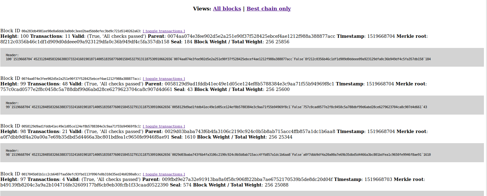

# Proof-Of-Work-UTXO-and-more
Project that consist on the implementation of a POW and POA system and a mining system

For the POW and POA system:

The folder contains several python files with different uses. They implement a Proof of Work and Proof of Authority systems. The scripts will be used in the P2P system when populating the blockchain. They check whether or not the blocks added to the chain are valid based on the block requirements for the blockchain main chain.

For the P2P system:

To install the Chain, simply install Python 3.9, and Python “Pip” for Python 3.9. YOU MUST BE USING PYTHON 3.9+

Then, run sudo python3 -m pip install -r requirements.txt to install all the requirements locally.

After installing the requirements, python3 add_random_pow_blockchain.py will populate your database with a fresh random proof of work blockchain; its execution should yield no errors. This should make a blockchain of 100 blocks and may take several seconds to run.

To run the web interface where you can interact with your blockchain, understand it, and debug, run python3 run_webapp.py. Browsing to localhost:5000 in your browser should then yield a screen that lets you inspect the blocks in the chain

Database Management
To clear the database, simply remove all contents of the database folder; you may need to do this if the database becomes corrupted or you wish to regenerate it for any reason.

You can also change the database location on disk by editing the config.py file.

Running Tests
To run a single test, use Python module run format from the root directory (e.g. - python3.9 -m tests.hash to run the hash test). To run all tests, run python3.9 run_all_tests.py in the root directory.
